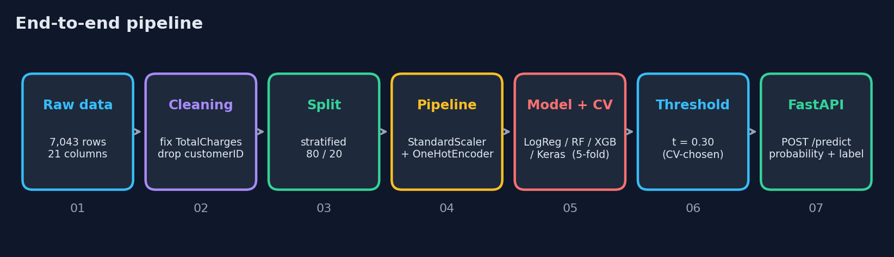
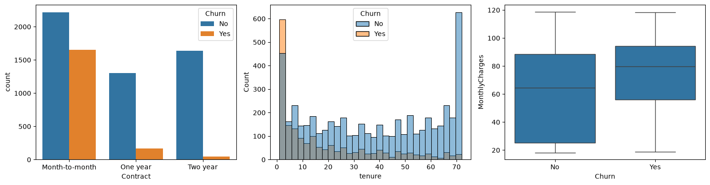
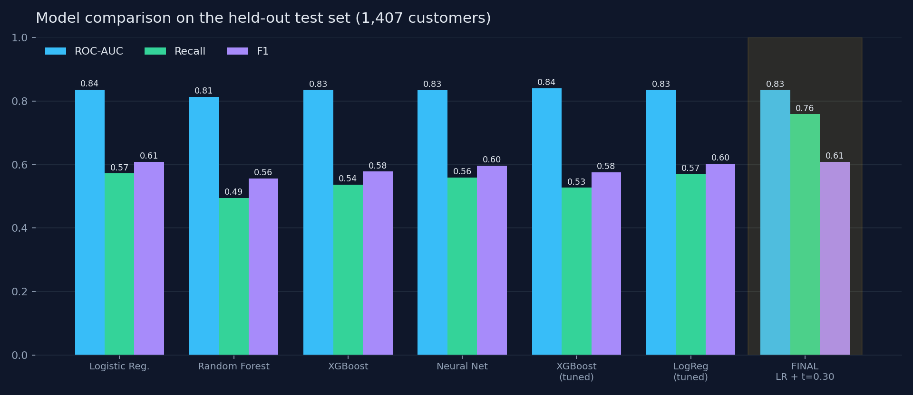
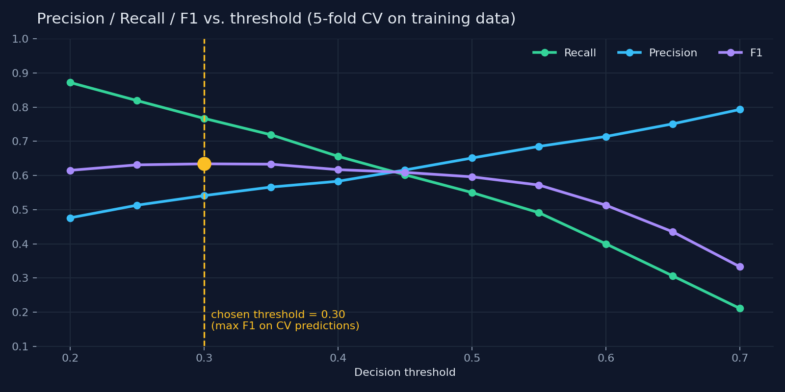
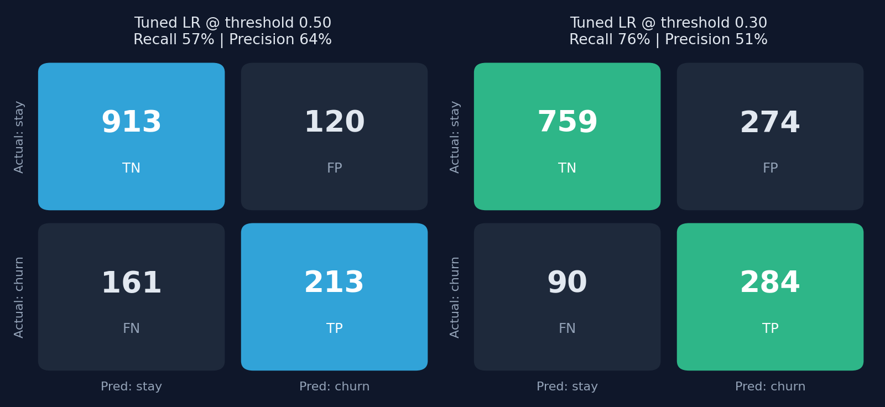

<div align="center">

# 📉 Customer Churn Prediction & Deployment Pipeline

### From raw telecom data to a live prediction API

<p>
  
  
  
  
  
</p>

<p>
  <b>76% churn recall</b> &nbsp;•&nbsp; <b>0.84 ROC-AUC</b> &nbsp;•&nbsp; <b>Leakage-safe pipeline</b> &nbsp;•&nbsp; <b>Real-time REST inference</b>
</p>



</div>

---

## ✨ Overview

Acquiring a new customer costs far more than keeping an existing one. This project predicts **which telecom customers are likely to leave**, so retention teams can intervene early.

I trained and compared four model families, tuned them with cross-validation, and then optimised the **decision threshold** to catch more churners, which turned out to be the single biggest lever. The final pipeline is served through a **FastAPI** endpoint that returns a churn probability and a decision in real time.

| | |
|---|---|
| 🎯 **Task** | Binary classification (churn vs. stay) |
| 🗂️ **Data** | IBM Telco Customer Churn, 7,032 customers after cleaning, ~26.5% churn rate |
| 🏆 **Final model** | Tuned Logistic Regression, decision threshold **0.30** |
| 📡 **Serving** | FastAPI + Uvicorn, auto-generated Swagger docs |

---

## 🔍 Exploratory Insights

<div align="center">
  
</div>

- **Contract type** is the strongest signal: month-to-month customers churn far more than those on one- or two-year plans.
- **Tenure:** churn is concentrated among new customers.
- **Monthly charges:** churners tend to pay higher bills.

---

## 🛠️ Approach

| Stage | What I did | Why |
|---|---|---|
| **Cleaning** | Converted `TotalCharges` to numeric, dropped 11 blank rows and `customerID` | Blank values belong to brand-new customers; IDs only add noise |
| **Split** | Stratified 80/20, `random_state=42` | Same churn ratio in train and test; reproducible |
| **Preprocessing** | `ColumnTransformer`: `StandardScaler` + `OneHotEncoder(handle_unknown="ignore")` | No fake category ordering; API-safe for unseen values |
| **Leakage control** | Everything wrapped in a scikit-learn `Pipeline` | Encoders/scalers are fitted on training folds only, including inside cross-validation |
| **Models** | Logistic Regression, Random Forest, XGBoost, Keras MLP | Simple baseline to deep model |
| **Tuning** | `GridSearchCV` / `RandomizedSearchCV`, 5-fold CV | Test set stays untouched |
| **Threshold** | Chosen on **out-of-fold training predictions** (max F1) | Honest estimate, no peeking at the test set |
| **Serving** | Whole pipeline saved with `joblib`, exposed via FastAPI | Training and serving transform data identically |

---

## 📊 Results

All numbers are measured on the **held-out test set (1,407 customers, 374 churners)**.

| Model | Accuracy | Precision | Recall | F1 | ROC-AUC |
|---|:---:|:---:|:---:|:---:|:---:|
| Logistic Regression | 0.804 | 0.648 | 0.572 | 0.608 | 0.836 |
| Random Forest | 0.790 | 0.636 | 0.495 | 0.556 | 0.813 |
| XGBoost | 0.792 | 0.626 | 0.537 | 0.578 | 0.835 |
| Neural Network (Keras) | 0.800 | 0.641 | 0.559 | 0.597 | 0.834 |
| XGBoost (tuned) | 0.794 | 0.635 | 0.527 | 0.576 | 0.840 |
| Logistic Regression (tuned) | 0.800 | 0.640 | 0.570 | 0.603 | 0.835 |
| **🏆 Final: LR (tuned) + threshold 0.30** | 0.741 | 0.509 | **0.759** | 0.609 | 0.835 |

<div align="center">
  
</div>

### 💡 Key takeaways

1. **Simple wins here.** Tuned XGBoost and tuned Logistic Regression had near-identical cross-validated ROC-AUC (0.850 vs 0.846), so I shipped the simpler, faster, more interpretable model.
2. **Deep learning did not help.** The Keras network (0.834) matched Logistic Regression, which is typical for a small tabular dataset.
3. **Threshold tuning was the real win.** Moving the threshold from 0.50 to 0.30 raised recall from **57% to 76%**.

### 🎚️ Choosing the threshold

The threshold was selected from 5-fold cross-validated predictions on the training data, never the test set.

<div align="center">
  
</div>

### 🧮 What the threshold change means in practice

<div align="center">
  
</div>

At threshold 0.30 the model catches **71 more churners** (284 vs. 213) at the cost of 154 extra false alarms. Accuracy drops from 80% to 74%, but for churn a wasted retention offer is far cheaper than a lost customer. ROC-AUC is unchanged because it does not depend on the threshold.

---

## 🚀 Quick Start

```bash
# 1. Clone
git clone https://github.com/<HafizMustafa7>/churn-prediction.git
cd churn-prediction

# 2. Create and activate a virtual environment
python -m venv .venv
.venv\Scripts\activate          # Windows
# source .venv/bin/activate     # macOS / Linux

# 3. Install API dependencies
pip install -r requirements.txt

# 4. Run the API
uvicorn main:app --reload
```

Open **http://127.0.0.1:8000/docs** for the interactive Swagger UI.

<!-- Optional: add a screenshot of the Swagger page at images/swagger.png and uncomment the next line
<div align="center"></div>
-->

### 🔌 Example request

`POST /predict`

```json
{
  "gender": "Female", "SeniorCitizen": 0, "Partner": "No", "Dependents": "No",
  "tenure": 2, "PhoneService": "Yes", "MultipleLines": "No",
  "InternetService": "Fiber optic", "OnlineSecurity": "No", "OnlineBackup": "No",
  "DeviceProtection": "No", "TechSupport": "No", "StreamingTV": "No",
  "StreamingMovies": "No", "Contract": "Month-to-month", "PaperlessBilling": "Yes",
  "PaymentMethod": "Electronic check", "MonthlyCharges": 85.5, "TotalCharges": 171.0
}
```

**Response**

```json
{
  "churn_probability": 0.4704,
  "churn_prediction": "Yes",
  "threshold_used": 0.3
}
```

> A probability of 0.47 would be labelled "No" at the default 0.5 threshold. The tuned 0.30 threshold catches this at-risk customer, which is exactly where the recall gain comes from.

### 🐍 Call it from Python

```python
import requests

customer = {...}  # same JSON as above
r = requests.post("http://127.0.0.1:8000/predict", json=customer)
print(r.json())
```

---

## 📁 Project Structure

```
churn-prediction/
├── churn.ipynb              # Full workflow: EDA → models → tuning → export
├── main.py                  # FastAPI application
├── requirements.txt         # API dependencies
├── model/
│   ├── churn_pipeline.joblib   # Preprocessor + tuned Logistic Regression
│   └── threshold.json          # Decision threshold (0.30)
├── images/                  # Charts used in this README
└── data/                    # Dataset (not tracked, see below)
```

**Dataset:** download `WA_Fn-UseC_-Telco-Customer-Churn.csv` from [Kaggle](https://www.kaggle.com/datasets/blastchar/telco-customer-churn) and place it in `data/` to re-run the notebook.

---

## 🧰 Tech Stack

| Area | Tools |
|---|---|
| Language | Python |
| Data | Pandas, NumPy |
| Classical ML | scikit-learn, XGBoost |
| Deep learning | TensorFlow / Keras |
| Visualisation | Matplotlib, Seaborn |
| Serving | FastAPI, Uvicorn, Pydantic |
| Persistence | joblib |

---

## ⚠️ Limitations & Future Work

- **Single dataset, single split.** Results come from one 80/20 split; repeated CV on the full data would tighten the estimates.
- **Threshold is chosen on F1.** A real deployment should pick it from actual costs (retention offer cost vs. customer lifetime value).
- **Possible next steps:** feature engineering (e.g. `TotalCharges / tenure`), SMOTE or class weights inside CV, probability calibration, SHAP explanations, Docker image and cloud deployment, monitoring for data drift.

---

<div align="center">

If you found this project useful, consider giving it a ⭐

</div>
